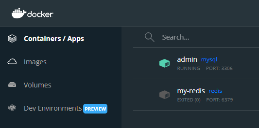

# PDocker
***
### Descripción general

***
### Tecnologías utilizadas
* [Java](https://www.java.com/es/): Versión 17
* [Apache Maven](https://maven.apache.org/): Versión 3.8.3
* [Spring Boot](https://spring.io/projects/spring-boot): Versión 2.6.2
* [Docker Desktop](https://www.docker.com/products/docker-desktop): Versión 4.3.1
* [MySQL](https://hub.docker.com/_/mysql): Versión 8.0.27-1debian10
* [MySQL Workbench](https://www.mysql.com/products/workbench/): Versión 8.0.27
***
### Para tener en cuenta
* Tener instalado el Docker Desktop y el MySQL Workbench. Los enlaces para su descarga se encuentran en la sección _Tecnologías utilizadas_.
***
### Corriendo el proyecto
* __Abrir Docker Desktop y MySQL Workbench__ 
* __En una terminal, descargar y correr la imagen de MySQL__ : docker run --name admin -p 3306:3306 -e MYSQL_ROOT_PASSWORD=admin -d mysql
* __Verificar que la imagen de MySQL esté corriendo__ :

* __En el MySQL Workbench, crear una nueva conexión__ :
* __Abrir la conexión y en el Query crear la base de datos__ :
* __En el Query crear el usuario__ :
* __Insertar un elemento a la base de datos__ :
* __Ubicarse en el directorio en dónde se encuentra el repositorio.__
* __Correr el proyecto__ : mvn spring-boot:run
***
### Ejemplos
* __Mostrar todas las personas registradas__ : http://localhost:8090/listar
* __Mostrar una persona dependiendo de su ID__ : http://localhost:8090/buscar?id=1
* __Agregar persona__ : http://localhost:8090/agregar?nombre=Pablo&apellidos=Castellanos&edad=15
* __Editar persona__ : http://localhost:8090/editar?id=1&nombre=Carlos&apellidos=Castellanos&edad=25
* __Eliminar persona__ : http://localhost:8090/eliminar?id=1
***
### Autores
##### Joseph Fabian Basto Cuadros, estudiante de Ingeniería de Sistemas.
##### Liliana Paola Castellanos Pinzón, estudiante de Ingeniería de Sistemas.
